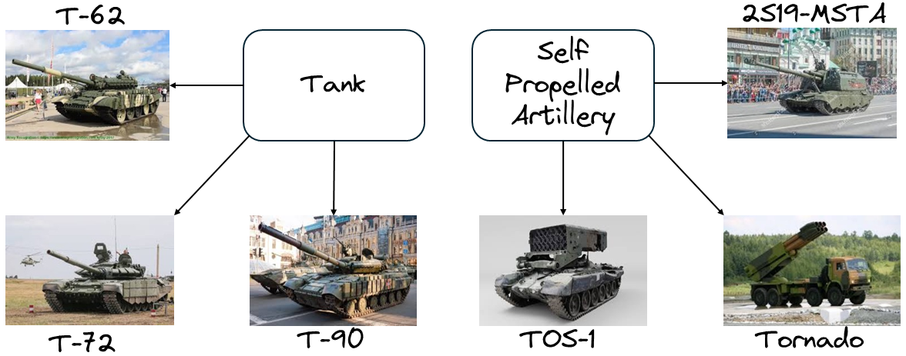

<p align="center">
    
</p>

<!-- [](https://github.com/krichelj/PyDiffGame/actions/workflows/pages/pages-build-deployment) -->

[](https://opensource.org/licenses/MIT)

- [What is this?](#what-is-this)
- [Example](#example)

# What is this?

[`PyEDCR`](https://github.com/lab-v2/metacognitive_error_detection_and_correction_v2/tree/master) is a Python implementation of the f-EDR (Focused Error Detection Rules) paradigm. The goal of EDR is to use a set of conditions to learn when a machine learning model makes an incorrect prediction. 

The EDCR method was first introduced in '_Rule-Based Error Detection and Correction to Operationalize Movement Trajectory Classification_' ([ArXiv preprint](https://arxiv.org/abs/2308.14250)) and later extended to the f-EDR method in the conference article '_Error Detection and Constraint Recovery in Hierarchical Multi-Label Classification without Prior Knowledge_' presented at CIKM 2024 ([ACM Publication](https://dl.acm.org/doi/10.1145/3627673.3679918), [ArXiv Preprint](https://arxiv.org/abs/2407.15192)).

The package was tested for Python >= 3.9.

If you use this work, please cite our paper:
```
@inproceedings{10.1145/3627673.3679918,
author = {Kricheli, Joshua Shay and Vo, Khoa and Datta, Aniruddha and Ozgur, Spencer and Shakarian, Paulo},
title = {Error Detection and Constraint Recovery in Hierarchical Multi-Label Classification without Prior Knowledge},
year = {2024},
isbn = {9798400704369},
publisher = {Association for Computing Machinery},
address = {New York, NY, USA},
url = {https://doi.org/10.1145/3627673.3679918},
doi = {10.1145/3627673.3679918},
abstract = {Recent advances in Hierarchical Multi-label Classification (HMC), particularly neurosymbolic-based approaches, have demonstrated improved consistency and accuracy by enforcing constraints on a neural model during training. However, such work assumes the existence of such constraints a-priori. In this paper, we relax this strong assumption and present an approach based on Error Detection Rules (EDR) that allow for learning explainable rules about the failure modes of machine learning models. We show that these rules are not only effective in detecting when a machine learning classifier has made an error but also can be leveraged as constraints for HMC, thereby allowing the recovery of explainable constraints even if they are not provided. We show that our approach is effective in detecting machine learning errors and recovering constraints, is noise tolerant, and can function as a source of knowledge for neurosymbolic models on multiple datasets, including a newly introduced military vehicle recognition dataset.},
booktitle = {Proceedings of the 33rd ACM International Conference on Information and Knowledge Management},
pages = {3842–3846},
numpages = {5},
keywords = {hierarchical multi-label classification, learning with constraints, metacognitive ai, neurosymbolic ai, rule learning},
location = {Boise, ID, USA},
series = {CIKM '24}
}
```

# Example

To demonstrate the use of the package, we consider a dataset with two levels of hierarchy, such that each image has a fine-grain and coarse-grain label. For example, consider the following example from our curated Military Vehicle (which can be found [here](https://huggingface.co/datasets/lab-v2/military_vehicles)):

<p align="center">
    
</p>

We further consider a pretrained 'main' model, for example one which employed the small version of [Meta's _DINO_V2_ architecture](https://dinov2.metademolab.com/) and was fine-tuned on ImageNet50 - a subset of the [ImageNet1K dataset](https://www.image-net.org/index.php) with 50 classes (which can be found [here](https://huggingface.co/datasets/lab-v2/ImageNet50)), which we want to analyze its ability to classify both levels of the hierarchy. An instance of such model (which can be found [here](https://huggingface.co/lab-v2/dinov2_vits14_imagenet_lr1e-06_BCE)) has the following performance:

Fine-grain prior combined accuracy: <span style="color:green">76.57</span>% , fine-grain prior combined macro f1: <span style="color:green">76.1</span>%\
Fine-grain prior combined macro precision: <span style="color:green">76.96</span>% , fine-grain prior combined macro recall: <span style="color:green">76.57</span>%

Coarse-grain prior combined accuracy: <span style="color:green">87.14</span>%, coarse-grain prior combined macro f1: <span style="color:green">85.77</span>%\
Coarse-grain prior combined macro precision: <span style="color:green">87.36</span>%, coarse-grain prior combined macro recall: <span style="color:green">84.64</span>%

Total prior inconsistencies <span style="color:red">133/2100</span> (<span style="color:red">6.33</span>%)

We also consider a 'secondary' model (which can be found [here](https://huggingface.co/lab-v2/dinov2_vitl14_imagenet_lr1e-06_BCE)), which employed the large version of the DINO_V2 architecture and was also fine-tuned on the ImageNet50 dataset, along with binary models which were trained on each class of the dataset.
Consider the following code snippet to run the `run_experiment` function from PyEDCR.py:

```python

from PyEDCR.classes import experiment_config
from PyEDCR.PyEDCR import run_experiment

imagenet_config = experiment_config.ExperimentConfig(
    data_str='imagenet',
    main_model_name='dinov2_vits14',
    secondary_model_name='dinov2_vitl14',
    main_lr=1e-6,
    secondary_lr=0.000001,
    binary_lr=0.000001,
    original_num_epochs=8,
    secondary_num_epochs=2,
    binary_num_epochs=5
)

run_experiment(config=imagenet_config)
```

The code will initiate the rule learning pipeline, use the rules learned to mark errors in the predictions of the main model, and print out the performance metrics of the algorithm on the error class after running the f-EDR algorithm, which in this case will be:

```
error_accuracy: 89.0%
error_balanced_accuracy: 84.23%
error_precision: 81.65%
error_recall: 74.31%
error_f1: 77.81%
recovered_constraints_precision: 100.0%
recovered_constraints_recall: 59.36%
recovered_constraints_f1_score: 74.5%
```

For further details about the rule learning algorithm, and noise tolerance experiments, please refer to the [paper](https://arxiv.org/abs/2407.15192).

# Acknowledgments

This research was funded by ARO grant W911NF-24-1-0007.

<p align="center">
<a href="https://arl.devcom.army.mil/who-we-are/aro/">

</a>
&emsp;
<a href="https://arl.devcom.army.mil/who-we-are/aro/">

</a>
&emsp;
&emsp;
<a href="https://labs.engineering.asu.edu/labv2/">

</a>
</p>